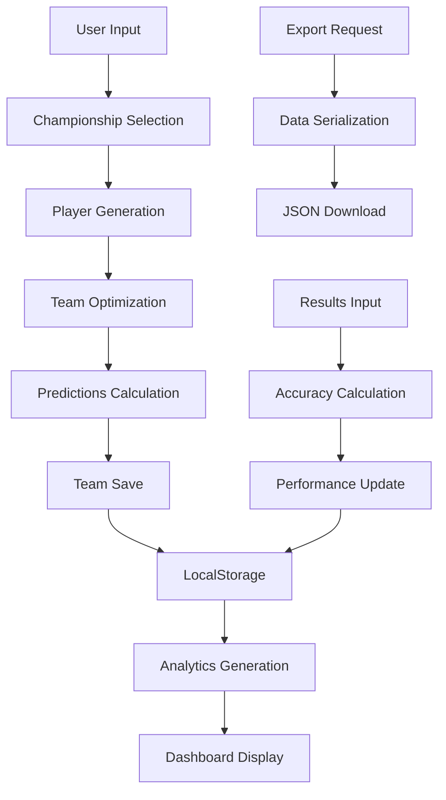

# 📚 Documentação das APIs e Estruturas de Dados

## 🎯 Visão Geral

Esta documentação detalha todas as estruturas de dados, APIs internas e interfaces do SuperMittos, fornecendo uma referência completa para desenvolvedores.

---

## 🏆 Sistema de Campeonatos

### 📋 Interface Championship

```typescript
interface Championship {
  id: string                    // Identificador único
  name: string                  // Nome do campeonato
  country: string               // País/região
  logo: string                  // Emoji ou URL do logo
  season: string                // Temporada (ex: "2024/25")
  teams: Team[]                 // Array de times
  totalPlayers: number          // Total de jogadores disponíveis
  currency: "EUR" | "USD" | "BRL" // Moeda utilizada
  averageMarketValue: number    // Valor médio de mercado
}
```

### 📋 Interface Team

```typescript
interface Team {
  id: string                    // Identificador único
  name: string                  // Nome do time
  shortName: string             // Nome abreviado (3 letras)
  city: string                  // Cidade
  founded: number               // Ano de fundação
  stadium: string               // Nome do estádio
  marketValue: number           // Valor total do elenco
  players: Player[]             // Jogadores do time
}
```

### 📋 Interface Player

```typescript
interface Player {
  id: number                    // ID único do jogador
  name: string                  // Nome completo
  position: PlayerPosition      // Posição no campo
  team: string                  // Nome do time
  rating: number                // Rating (1-100)
  marketValue: number           // Valor de mercado em €
  nationality: string           // Nacionalidade
  age: number                   // Idade (18-40)
  height: number                // Altura em cm
  preferredFoot: "left" | "right" | "both" // Pé preferido
  
  // Estatísticas específicas por posição
  stats: PlayerStats
}

type PlayerPosition = "GK" | "DEF" | "MID" | "ATT"

interface PlayerStats {
  // Estatísticas gerais
  appearances: number           // Jogos disputados
  minutes: number              // Minutos jogados
  goals: number                // Gols marcados
  assists: number              // Assistências
  yellowCards: number          // Cartões amarelos
  redCards: number             // Cartões vermelhos
  
  // Estatísticas específicas
  cleanSheets?: number         // Para goleiros
  saves?: number               // Para goleiros
  tackles?: number             // Para defensores
  passes?: number              // Para meio-campistas
  shots?: number               // Para atacantes
}
```

---

## 🧠 Sistema de Otimização

### 📋 Interface OptimizationParams

```typescript
interface OptimizationParams {
  budget: number                // Orçamento disponível
  formation: Formation          // Formação tática
  strategy: OptimizationStrategy // Estratégia de otimização
  constraints: Constraints      // Restrições adicionais
}

type Formation = "4-3-3" | "4-4-2" | "3-5-2" | "5-3-2"

type OptimizationStrategy = "conservative" | "balanced" | "aggressive"

interface Constraints {
  maxPlayersPerTeam: number     // Máx jogadores do mesmo time
  minNationalities: number      // Mín nacionalidades diferentes
  maxAge: number                // Idade máxima
  minRating: number             // Rating mínimo
}
```

### 📋 Interface OptimizedTeam

```typescript
interface OptimizedTeam {
  players: Player[]             // 11 jogadores selecionados
  totalCost: number            // Custo total do time
  averageRating: number        // Rating médio
  formation: Formation         // Formação utilizada
  predictions: TeamPredictions // Previsões de performance
  confidence: number           // Confiança (0-100)
  riskLevel: RiskLevel        // Nível de risco
}

type RiskLevel = "low" | "medium" | "high"
```

---

## 📊 Sistema de Histórico

### 📋 Interface TeamHistory

```typescript
interface TeamHistory {
  id: string                    // UUID único
  name: string                  // Nome do time criado
  championship: Championship    // Campeonato selecionado
  formation: Formation          // Formação utilizada
  budget: number               // Orçamento configurado
  totalCost: number            // Custo real do time
  players: HistoryPlayer[]     // Jogadores salvos
  predictions: TeamPredictions // Previsões iniciais
  actualResults?: TeamResults  // Resultados reais (opcional)
  status: TeamStatus           // Status atual
  createdAt: string            // Data de criação (ISO)
  updatedAt?: string           // Data da última atualização
  notes?: string               // Observações do usuário
}

type TeamStatus = "pending" | "active" | "completed" | "cancelled"

interface HistoryPlayer {
  id: number                   // ID original do jogador
  name: string                 // Nome no momento da criação
  position: PlayerPosition     // Posição
  team: string                 // Time no momento da criação
  rating: number               // Rating no momento
  marketValue: number          // Valor no momento
}
```

### 📋 Interface TeamPredictions

```typescript
interface TeamPredictions {
  expectedPoints: number        // Pontos esperados
  expectedGoals: number        // Gols esperados
  expectedAssists: number      // Assistências esperadas
  expectedCleanSheets: number  // Jogos sem levar gol
  confidence: number           // Confiança da previsão (0-100)
  riskLevel: RiskLevel        // Nível de risco
  notes: string               // Explicação da previsão
  
  // Previsões por posição
  performanceByPosition: {
    [position in PlayerPosition]: {
      expectedContribution: number
      riskFactor: number
    }
  }
  
  // Melhores apostas
  bestBets: {
    playerId: number
    playerName: string
    expectedPerformance: number
    confidence: number
  }[]
}
```

### 📋 Interface TeamResults

```typescript
interface TeamResults {
  actualPoints: number         // Pontos reais obtidos
  actualGoals: number          // Gols reais marcados
  actualAssists: number        // Assistências reais
  actualCleanSheets: number    // Clean sheets reais
  matchesPlayed: number        // Jogos disputados
  accuracy: number             // Acurácia (0-100)
  
  // Performance detalhada
  performanceByPosition: {
    [position in PlayerPosition]: {
      actualContribution: number
      accuracyForPosition: number
    }
  }
  
  // Melhores e piores performers
  bestPerformers: {
    playerId: number
    playerName: string
    actualPerformance: number
    expectedPerformance: number
    overperformance: number
  }[]
  
  worstPerformers: {
    playerId: number
    playerName: string
    actualPerformance: number
    expectedPerformance: number
    underperformance: number
  }[]
  
  updatedAt: string            // Data da atualização
}
```

---

## 📈 Sistema de Analytics

### 📋 Interface PerformanceMetrics

```typescript
interface PerformanceMetrics {
  // Métricas globais
  totalTeamsCreated: number
  averageAccuracy: number
  bestAccuracy: number
  worstAccuracy: number
  totalPointsEarned: number
  totalPointsExpected: number
  
  // Breakdown por campeonato
  championshipBreakdown: {
    [championshipId: string]: {
      championshipName: string
      teamsCreated: number
      averageAccuracy: number
      totalPoints: number
      bestTeam: string
      worstTeam: string
    }
  }
  
  // Breakdown por formação
  formationBreakdown: {
    [formation: string]: {
      teamsCreated: number
      averageAccuracy: number
      successRate: number
      averageRating: number
      mostUsedPlayers: string[]
    }
  }
  
  // Métricas temporais
  monthlyPerformance: {
    month: string
    teamsCreated: number
    averageAccuracy: number
    trend: "up" | "down" | "stable"
  }[]
  
  // Insights automáticos
  insights: {
    bestStrategy: Formation
    bestChampionship: string
    improvementAreas: string[]
    recommendations: string[]
  }
}
```

---

## 🔧 APIs Internas

### 🎯 useChampionshipData Hook

```typescript
interface UseChampionshipDataReturn {
  // Estado
  selectedChampionship: Championship | null
  championshipData: ChampionshipData | null
  loading: boolean
  error: string | null
  
  // Ações
  changeChampionship: (championshipId: string) => Promise<void>
  refreshData: () => Promise<void>
  
  // Utilitários
  getTopPlayers: (limit: number) => Player[]
  getPlayersByPosition: (position: PlayerPosition) => Player[]
  getTeamPlayers: (teamName: string) => Player[]
  searchPlayers: (query: string) => Player[]
}

interface ChampionshipData {
  championship: Championship
  teams: Team[]
  players: Player[]
  stats: {
    totalPlayers: number
    averageRating: number
    averageMarketValue: number
    topRatedPlayer: Player
    mostExpensivePlayer: Player
  }
}
```

### 🎯 useTeamHistory Hook

```typescript
interface UseTeamHistoryReturn {
  // Estado
  teamHistory: TeamHistory[]
  performanceMetrics: PerformanceMetrics | null
  loading: boolean
  error: string | null
  
  // CRUD Operations
  saveTeam: (teamData: CreateTeamData) => Promise<void>
  updateTeam: (teamId: string, updates: Partial<TeamHistory>) => Promise<void>
  deleteTeam: (teamId: string) => Promise<void>
  updateTeamResults: (teamId: string, results: Partial<TeamResults>) => Promise<void>
  
  // Consultas
  getTeamById: (teamId: string) => TeamHistory | null
  getTeamsByChampionship: (championshipId: string) => TeamHistory[]
  getTeamsByStatus: (status: TeamStatus) => TeamHistory[]
  getRecentTeams: (limit: number) => TeamHistory[]
  getBestPerformingTeams: (limit: number) => TeamHistory[]
  
  // Utilitários
  calculateAccuracy: (predictions: TeamPredictions, results: Partial<TeamResults>) => number
  exportHistory: () => string
  importHistory: (data: string) => Promise<void>
  clearHistory: () => Promise<void>
}

interface CreateTeamData {
  name: string
  championship: Championship
  formation: Formation
  budget: number
  totalCost: number
  players: HistoryPlayer[]
  predictions: TeamPredictions
  status: TeamStatus
}
```

---

## 💾 Persistência de Dados

### 🗄️ LocalStorage Structure

```typescript
// Chave: 'supermittos_team_history'
interface StoredTeamHistory {
  version: string              // Versão do schema
  teams: TeamHistory[]         // Array de times
  lastUpdated: string          // Última atualização
  metadata: {
    totalTeams: number
    firstTeamDate: string
    lastTeamDate: string
  }
}

// Chave: 'supermittos_championship_cache'
interface StoredChampionshipCache {
  version: string
  championships: Championship[]
  lastUpdated: string
  expiry: string              // Data de expiração do cache
}

// Chave: 'supermittos_user_preferences'
interface UserPreferences {
  defaultChampionship: string
  defaultFormation: Formation
  defaultBudget: number
  theme: "light" | "dark"
  language: "pt" | "en"
  notifications: boolean
}
```

---

## 🔍 Algoritmos de Otimização

### 🧮 Formation Multipliers

```typescript
const FORMATION_MULTIPLIERS: Record<Formation, FormationMultipliers> = {
  "4-3-3": {
    attack: 1.3,      // +30% peso para ataque
    defense: 0.9,     // -10% peso para defesa
    midfield: 1.0     // Peso normal para meio
  },
  "4-4-2": {
    attack: 1.1,      // +10% peso para ataque
    defense: 1.0,     // Peso normal para defesa
    midfield: 1.2     // +20% peso para meio
  },
  "3-5-2": {
    attack: 1.0,      // Peso normal para ataque
    defense: 0.8,     // -20% peso para defesa
    midfield: 1.4     // +40% peso para meio
  },
  "5-3-2": {
    attack: 0.8,      // -20% peso para ataque
    defense: 1.3,     // +30% peso para defesa
    midfield: 1.0     // Peso normal para meio
  }
}

interface FormationMultipliers {
  attack: number
  defense: number
  midfield: number
}
```

### 🎲 Rating Generation Algorithm

```typescript
// Algoritmo para gerar ratings realistas por posição
const POSITION_RATING_RANGES: Record<PlayerPosition, RatingRange> = {
  "GK": { min: 65, max: 95, average: 78 },
  "DEF": { min: 60, max: 92, average: 75 },
  "MID": { min: 62, max: 94, average: 77 },
  "ATT": { min: 58, max: 96, average: 76 }
}

interface RatingRange {
  min: number
  max: number
  average: number
}

// Função de geração de rating com distribuição normal
function generateRealisticRating(position: PlayerPosition): number {
  const range = POSITION_RATING_RANGES[position]
  const stdDev = (range.max - range.min) / 6 // 99.7% dos valores dentro do range
  
  // Box-Muller transform para distribuição normal
  const u1 = Math.random()
  const u2 = Math.random()
  const z0 = Math.sqrt(-2 * Math.log(u1)) * Math.cos(2 * Math.PI * u2)
  
  const rating = Math.round(range.average + z0 * stdDev)
  
  // Clamp para garantir que está dentro do range
  return Math.max(range.min, Math.min(range.max, rating))
}
```

---

## 🔄 Fluxo de Dados

### 📊 Data Flow Diagram



### 🔄 Component Data Flow

```typescript
// Fluxo de dados entre componentes principais
App.tsx
├── ChampionshipSelector
│   ├── useChampionshipData()
│   └── Player generation
├── TeamOptimizer
│   ├── Optimization algorithm
│   ├── Predictions calculation
│   └── useTeamHistory.saveTeam()
├── TeamHistoryView
│   ├── useTeamHistory()
│   ├── UpdateResultsModal
│   └── Performance analytics
└── Dashboard
    ├── useTeamHistory()
    └── Performance metrics display
```

---

## 🧪 Testing Structure

### 🎯 Test Data Interfaces

```typescript
// Dados de teste para desenvolvimento
interface TestData {
  mockChampionships: Championship[]
  mockPlayers: Player[]
  mockTeamHistory: TeamHistory[]
  mockPerformanceMetrics: PerformanceMetrics
}

// Factory functions para gerar dados de teste
interface TestDataFactory {
  createMockPlayer: (overrides?: Partial<Player>) => Player
  createMockTeam: (overrides?: Partial<Team>) => Team
  createMockChampionship: (overrides?: Partial<Championship>) => Championship
  createMockTeamHistory: (overrides?: Partial<TeamHistory>) => TeamHistory
}
```

---

## 🔐 Segurança e Validação

### ✅ Validation Schemas

```typescript
// Schemas de validação usando Zod ou similar
const PlayerSchema = z.object({
  id: z.number().positive(),
  name: z.string().min(2).max(50),
  position: z.enum(["GK", "DEF", "MID", "ATT"]),
  rating: z.number().min(1).max(100),
  marketValue: z.number().positive(),
  age: z.number().min(18).max(40)
})

const TeamHistorySchema = z.object({
  id: z.string().uuid(),
  name: z.string().min(1).max(100),
  formation: z.enum(["4-3-3", "4-4-2", "3-5-2", "5-3-2"]),
  budget: z.number().positive(),
  totalCost: z.number().positive(),
  players: z.array(PlayerSchema).length(11),
  status: z.enum(["pending", "active", "completed", "cancelled"])
})
```

---

## 📋 Changelog e Versioning

### 🏷️ Version Schema

```typescript
interface Version {
  major: number        // Breaking changes
  minor: number        // New features
  patch: number        // Bug fixes
  build?: string       // Build metadata
}

// Exemplo: v2.1.3-beta.1
interface VersionInfo {
  version: Version
  releaseDate: string
  features: string[]
  bugfixes: string[]
  breaking: string[]
  deprecated: string[]
}
```

---

<div align="center">

## 🎯 **Documentação Completa - SuperMittos**

Esta documentação fornece uma visão detalhada de todas as estruturas de dados e APIs do SuperMittos. Para dúvidas ou sugestões, abra uma [issue no GitHub](https://github.com/cristiano-superacao/Apostas_Cartola/issues).

**[🏠 Voltar ao README](../README.md) | [🌍 Testar Live](https://supermittos.netlify.app)**

</div>